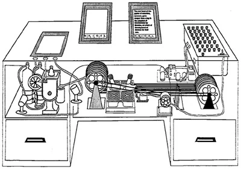

# Memex for Model Context Protocol

Memex is a tool for Model Context Protocol (MCP) that allows you to analyze web content and add it to your knowledge base.

The tool was inspired by the [Memex](docs/as_we_may_think.pdf) project by [Vannevar Bush](https://en.wikipedia.org/wiki/Vannevar_Bush).

## Requirements

You will need API keys for the following services:

- [Claude API](https://www.anthropic.com/en/claude)
- [FireCrawl API](https://www.firecrawl.com/)
- [Voyage API](https://voyageai.com/)

The knowledge base produced by this tool is stored as Markdown files so they can be viewed with any Markdown viewer but [Obsidian](https://obsidian.md/) is recommended.

## Installation

```bash
pip install mcp-memex
```

Add the following to your `claude_desktop_config.json` and replace the placeholders with the actual paths and API keys:

```json
{
  "mcpServers": {
    "memex": {
      "command": "uv",
      "args": [
        "--directory",
        "PATH_TO_LOCAL_MEMEX_REPO",
        "run",
        "mcp-memex",
        "--index",
        "PATH_TO_MEMEX_INDEX",
        "--workspace",
        "PATH_TO_OBSIDIAN_VAULT"
      ],
      "env": {
        "ANTHROPIC_API_KEY": "YOUR-API-KEY",
        "FIRECRAWL_API_KEY": "YOUR-API-KEY",
        "VOYAGE_API_KEY": "YOUR-API-KEY"
      }
    }
  }
}
```

## Usage

Start by asking Claude a question with a list of URLs to reference.

```
What is the capital of France? "https://en.wikipedia.org/wiki/France"
```

Once Claude has finished analyzing the content, you will see the results in your Obsidian vault. You can then ask questions about the content and Memex will use the knowledge base to answer your questions.

```
What is the capital of France?
```

## Development

To run the tool locally, you can use the following command:

```bash
npx @modelcontextprotocol/inspector \
  uv \
  --directory PATH_TO_LOCAL_MEMEX_REPO \
  run \
  mcp-memex \
  --index PATH_TO_MEMEX_INDEX \
  --workspace PATH_TO_OBSIDIAN_VAULT
```

Then open the inspector and connect to the server.

http://localhost:5173?timeout=30000
